# WAPH-Web Application Programming and Hacking

## Instructor: Dr. Phu Phung

## Individual Project 1

## Front-end Web Development with a Professional Profile Website on github.io cloud service

## Student

**Name**: Sai Keerthi Vadnala

**Email**: vadnalsi@ucmail.uc.edu

**Short-bio**: Sai Keerthi Vadnala has great interest in learning web development and wants to explore more about it by doing handson projects.

 

## Overview and Requirements

- This project focuses on enhancing front-end web development skills through the creation and deployment of a Professional Profile Website on GitHub's cloud service, github.io. 
- The project encompasses general, non-technical, and technical requirements.

## Repository Information

Respository's URL: [https://github.com/Saikeerthi72/](https://github.com/Saikeerthi72/Saikeerthi72.github.io)

This is a private repository for Sai Keerthi Vadnala to store all code from the course. 

## Individual Project 1

- [Individual Project 1 deployment link](https://saikeerthi72.github.io/personal-portfolio/): Front-end Web Development with a Professional Profile Website on github.io cloud service.

## General requirements 

+ I have developed and deployed a personal website showcasing a professional profile, including essential details such as name, headshot, resume, contact information, educational background, experiences, and skills.
+ Firstly, I have created a repo and added file named waph.hmtl which contains the course contents. 
+ Next, I have created another html page named index.html, here I have used bootstrap to create a responsive web page and I have created a div element named 'container-fluid'.
+ I have created a side bar, which contains my headshot, email, birthday, location, resume, linkedin, github, waph course details. 
+ The resume link contains a 'href' tag and redirects to resume document.
+ In the class 'main-content', I have created a navbar with different list items like: About, resume, projects, blog, contact details. 
+ In the About page, I have included what domains I'm interested, and I have created all these in a seperate section with class name 'service', within that I have created different lists for each domain. 
+ In Resume page, I have included education, experience and skills details. For this I have created a separate article class named "resume", within that I have created seperate lists for each section.
+ Below is the screenshot of this task, (Fig. 2,3,4,5).

 

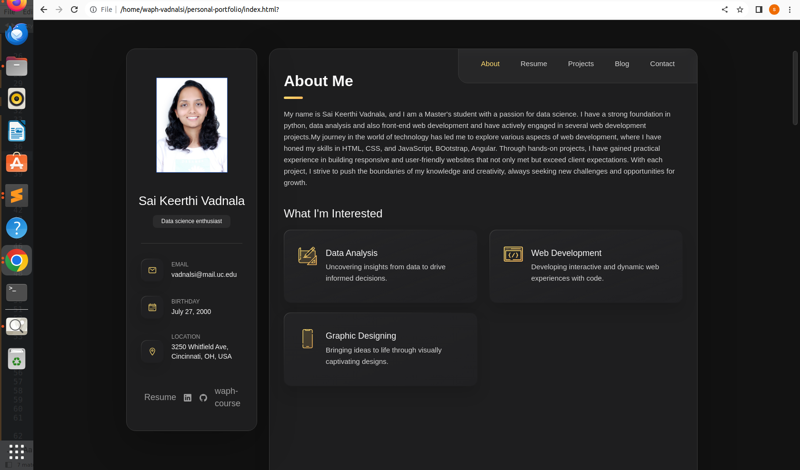 

 

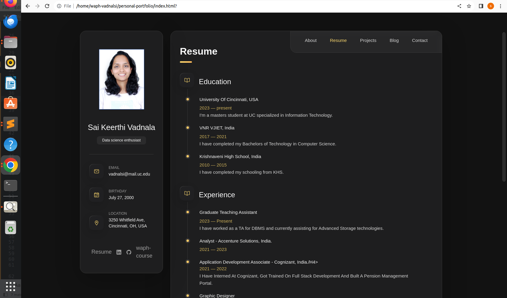 

 

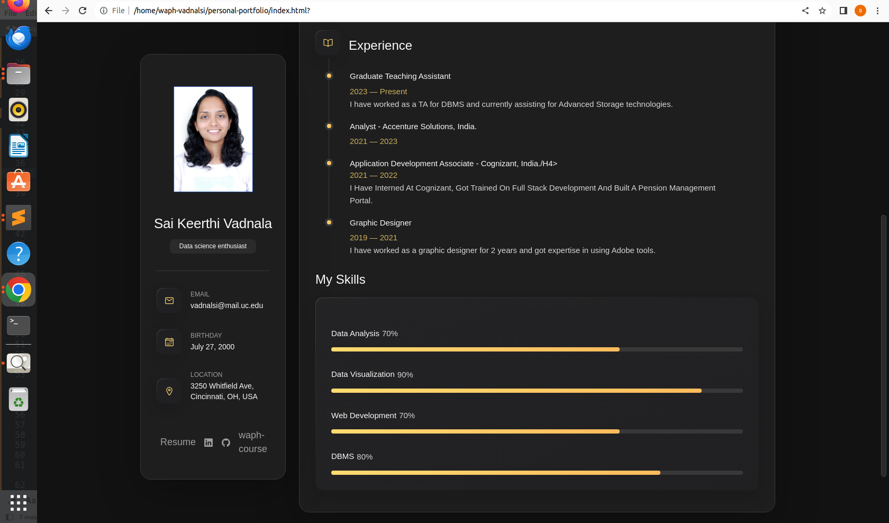 

 

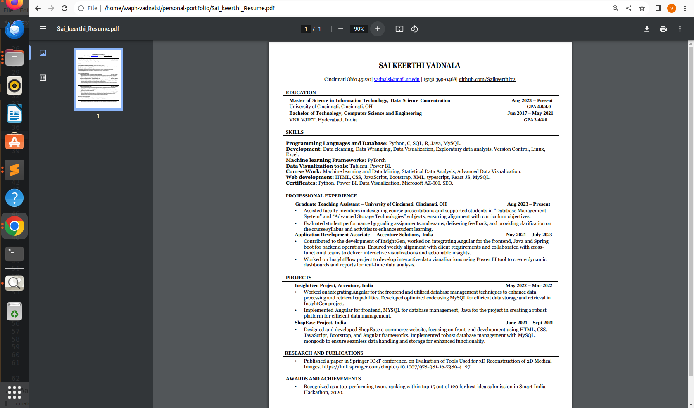 

+ I have created a link to a new dedicated HTML page named 'waph.html' to introduce the "Web Application Programming and Hacking" course contents, listed down the labs, hackathons and projects.
+ To create the link I have used 'a href' tag.
+ Below is the screenshot of this task, (Fig. 6,7).

 

 

 

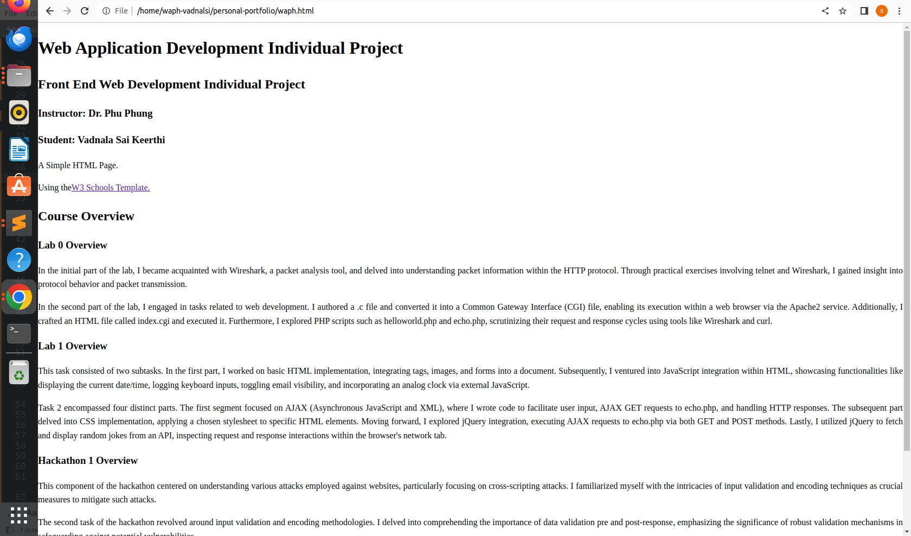 

​

## Non-technical requirements (20 pts)​

+ I have used an open-source CSS framework Bootstrap. 	
+ I followed the template idea presented by abhindu to develop my personal portfolio.
+ Below is the screenshot (Fig. 8).

 

 

+ Here we embed a flag counter into a webpage, which provides visual tracking of visitor counts (pageviews). The 'div' element acts as a container, enclosing the Flag Counter represented by the 'img' tag. The 'a' tag wraps the image, creating a hyperlink that redirects users to the Flag Counter website when clicked.

+ Below is the screenshot of the code and output of the task, (Fig. 9,10).

 

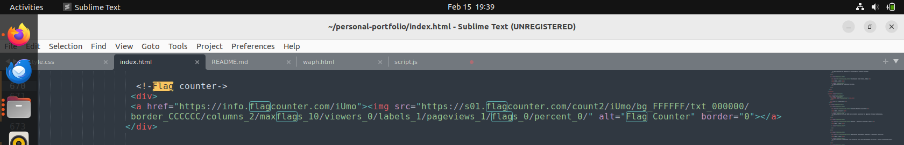 

 

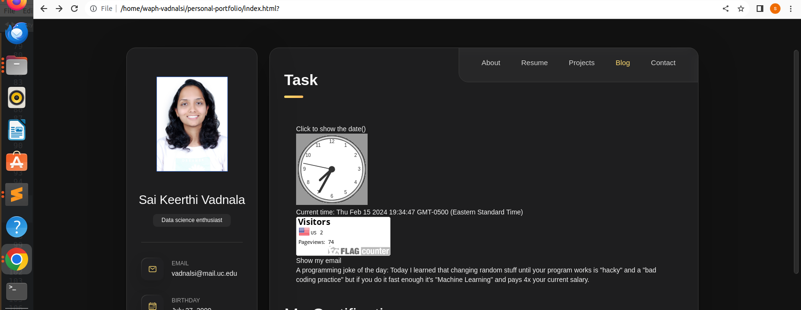 

## Technical requirements ​

### Basic JavaScript code ​

+ I have implemented show date(), analog clock, digital clock, show/hide your email functionalities. 
+ In show date(), I have created a 'div' element with the id "date", when clicked, it triggers the inbuilt JavaScript function to update the content of the 'div' with the current date and time.
+ Below is the code snippet for show date(), (fig. 11).

 

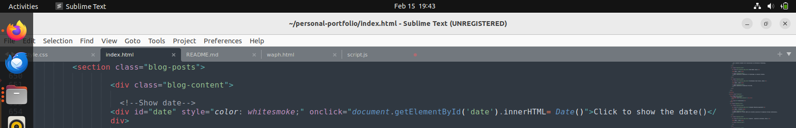 

+ In analog clock, I setted up a canvas element for analog clock, it includes a script tag to link an external JavaScript file for clock functionality. The JavaScript code initializes the clock by getting the canvas context, setting up the clock's dimensions, and then it calls drawClock() function to draw the clock for every second.
+ Below is the code snippet for analog clock, (fig. 12).

 

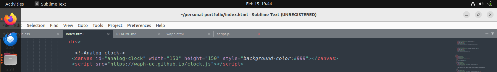 

+ In digital clock, I created a 'div' element with the id "digital-clock". The JavaScript code defined a function called 'displayTime()' that updates the content of the 'div' with the current time for every 500 milliseconds using the 'setInterval()' method.
+ Below is the code snippet for digital clock, (fig. 13).

 

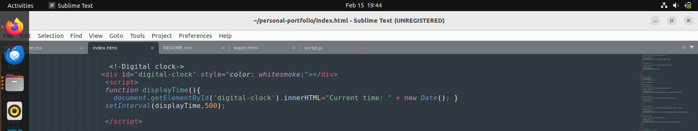 

+ For show/hide email functionality, to enables toggling the visibility of an email address when a 'div' element with the id "email" is clicked. Initially showing "Show my email", upon click, it reveals the email address as a hyperlink. This Toggling visibility is handled by JavaScript function 'showhideEmail()', with the visibility state is tracked by the 'shown' variable.
+ Below is the code snippet for show/hide email functionality, (fig. 14).

 

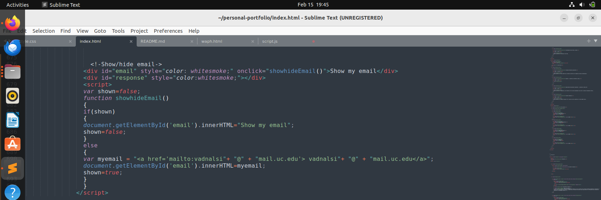 

+ Output for all these JS and JQuery functionalities is shown in the below screenshot, (fig. 15).

 

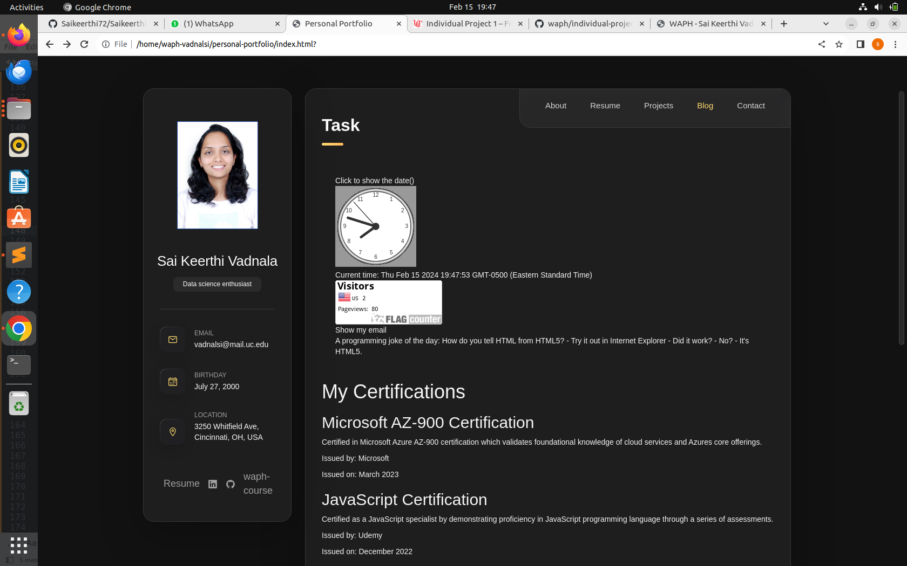 

### Angular functionality

+ I have used AngularJS to dynamically render a sections to present "My Certifications." It employs the ng-repeat directive to iterate over an array of certification objects, dynamically generating content for each certification entry based on its name, description, issuer, and date.
+ The AngularJS controller, named 'CertificationController', serves as a intermediary. Within this controller, an array named '$scope.certifications' is initialized, representing various certifications. Each object encapsulates essential information including certification's name, description, issuer, and issuance date.
+ By associating the 'CertificationController' with the 'portfolioApp' module, the controller establishes the data-binding.
+ Below is the code snippet and output for angular functionality, (fig, 16,17).

 

 

 

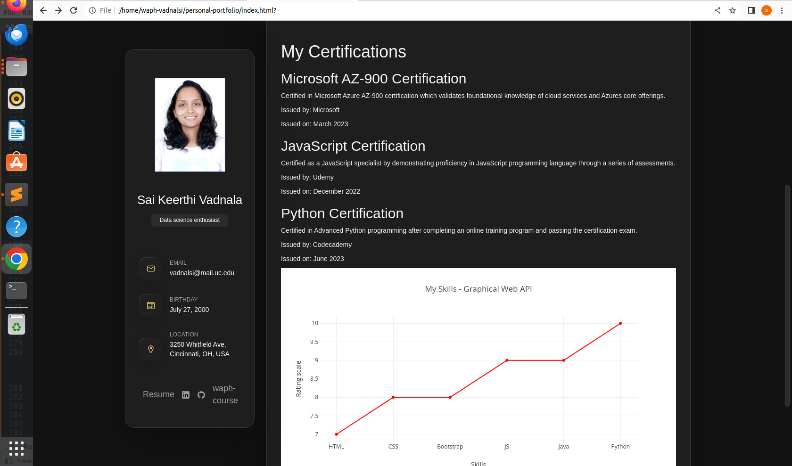 

### Two public Web APIs integration ​

+ This JavaScript code fetches a joke from the JokeAPI and displays on the webpage. It uses jQuery's '$.get()' method to make an asynchronous GET request to the specified URL, which returns a single programming joke. Upon receiving the response, the anonymous callback function is executed, logging the joke to the console and updating the content of the element with the id "response" to display the joke for every 60 seconds.
+ Below is the code snippet and output for digital clock, (fig. 18,19).

 

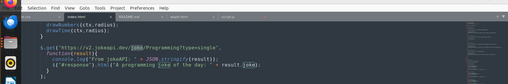 

 

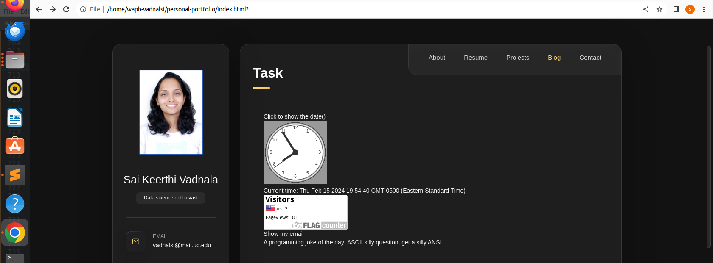 

+ Graphical web API
+ I have used Plotly.js, a graphing library, to generate a scatter plot to display skill rating. 
+ The 'xValues' array contains the skills, while 'yValues' represents their corresponding ratings.
+ The layout defines the title of the graph along with labels for the x and y axes.
+ The 'Plotly.newPlot()'' function creates the graph within a 'div' container with the id "myDiv".
+ Below is the code snippet and output for generating a chart using graphical web API, (fig. 20,21).

 

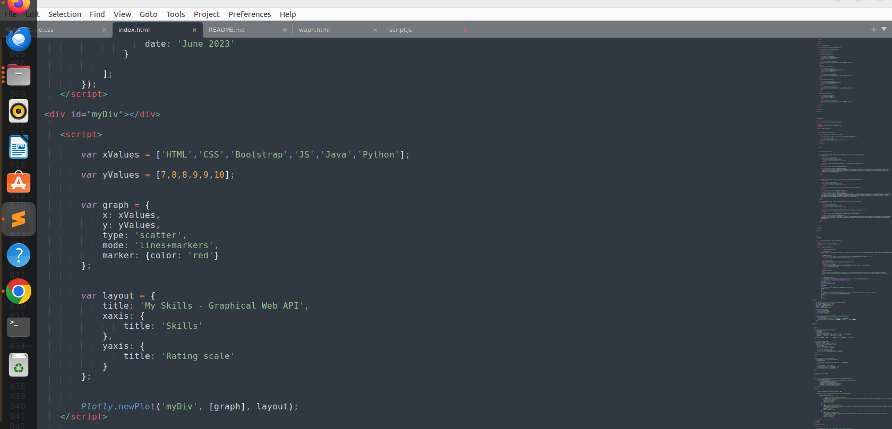 

 

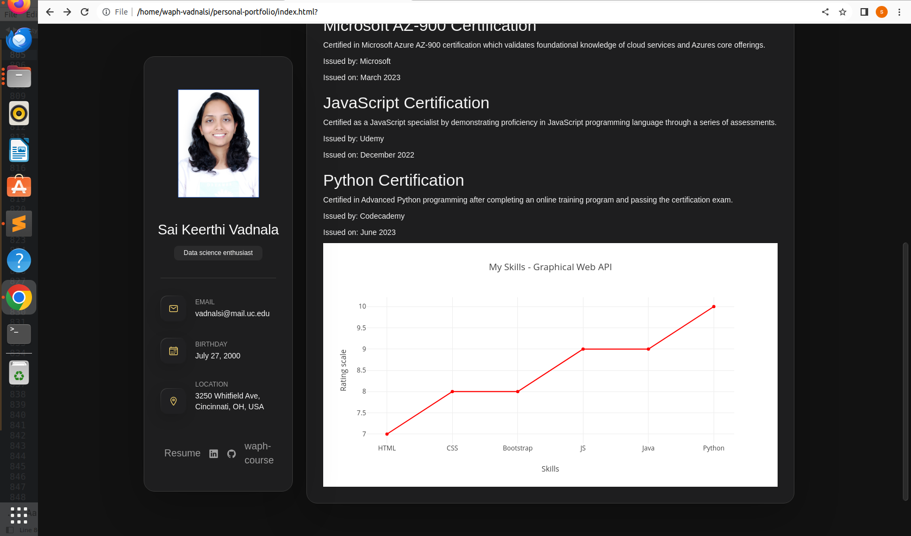 

###	 Using JavaScript cookies to remember the client 

+ The 'setCookie' function sets a cookie with the specified name, value, and expiration date in days.
+ The 'getCookie' function retrieves the value of a cookie by its name.
+ The 'displayWelcomeMessage' function checks if the user has visited the website before by retrieving the last visit timestamp from the cookie.
+ If the user has visited before, it displays a welcome back message with the timestamp of their last visit.
+ If it's the user's first visit, it sets a cookie with the current date as the last visit timestamp and displays a welcome message.

+ Below is the code snippet and output for above task(fig. 22,23,24).

 

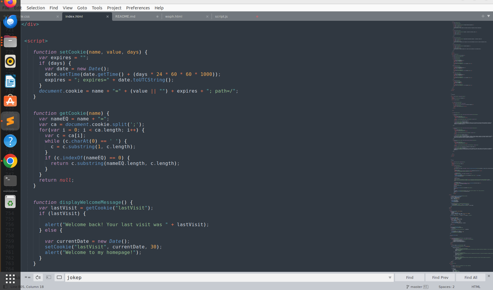 

 

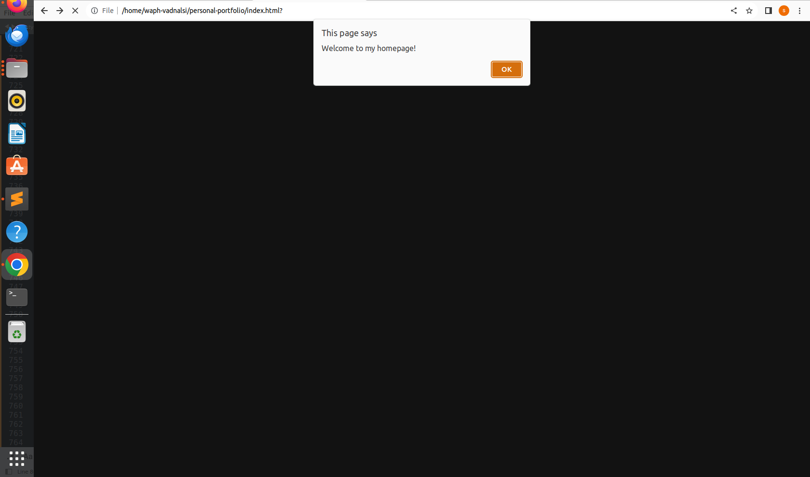 

 

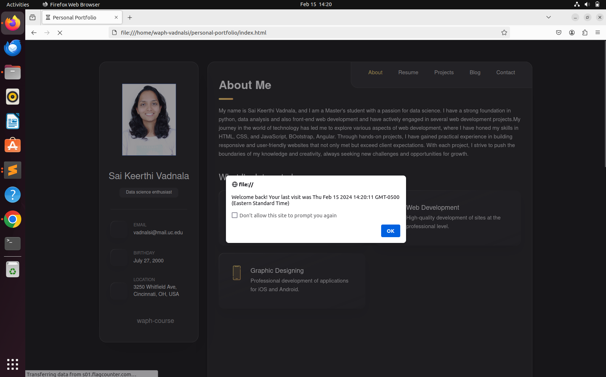 

